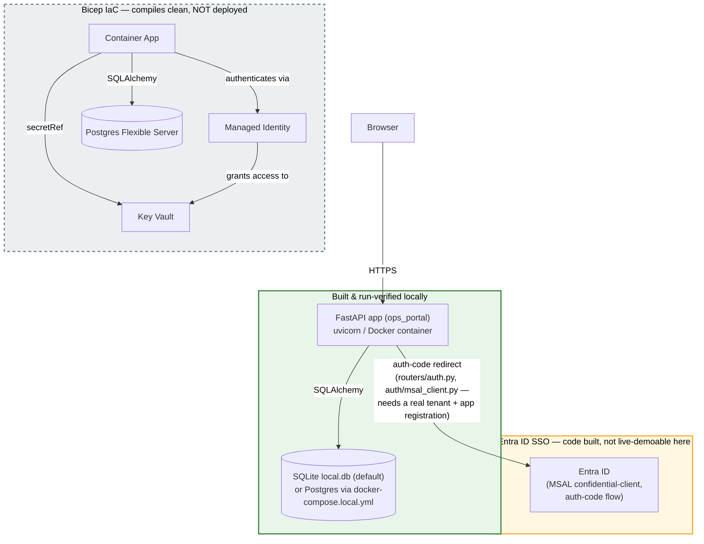

# Meridian Ops Portal (Project 5 — Capstone)

A single ops portal that pulls together three things a facilities team would otherwise juggle separately: a pipeline that cleans up a messy asset-registry CSV, a queue for reviewing and correcting flagged records, and a screen for triaging tickets. It sits behind Entra ID login, enforces who can approve what, and keeps an audit trail of every change — so a viewer can look but not touch, and nothing gets changed without a second person signing off.

## What's built and verified

The normalization pipeline (dates, currency, dashes, null tokens, dedup, entity resolution) is done and covered by tests — 97 tests pass, including idempotency (running it twice gives byte-identical output). It has now also been run against the real 648-row `sample-data/messy-asset-registry.csv`: 597 clean rows written, 0 rejected, 51 duplicate `asset_tag` groups resolved — twice, producing byte-identical output both times. (See "What I'd do differently" for the one thing that run didn't prove.)

The portal itself is up: Entra ID SSO, role-based access (viewer vs. approver enforced server-side, not just hidden in the UI), all four screens (dashboard, asset registry, review queue, ticket triage), a maker-checker approval flow (you can't approve your own request), and an append-only audit log recording who did what.

Docker is built and has been run-verified locally — the multi-stage image builds and the app comes up in a container.

The Bicep IaC (Container App, Postgres, Key Vault, managed identity) compiles clean. It has not been deployed anywhere.

## What's not done yet

CI validates but doesn't deploy. `.github/workflows/deploy.yml` runs the test suite, builds the Docker image, and compiles the Bicep template on every push to main — but that's where it stops; there's no step that pushes an image anywhere or deploys anything.

Nothing is deployed to Azure. The Bicep templates exist and compile, but no Container App, database, or Key Vault has actually been stood up.

## Setup

Requires Python 3.11+.

```bash
# install the package and dev dependencies (pytest, httpx)
pip install -e ".[dev]"

# run the test suite
pytest -v
```

To run the app locally, you need a `.env` file (copy `.env.example` and fill it in) — at minimum a `SESSION_SECRET_KEY` and, for sign-in to actually work, an Entra ID app registration (`ENTRA_TENANT_ID`, `ENTRA_CLIENT_ID`, `ENTRA_CLIENT_SECRET`). Without Entra credentials the app still starts and unauthenticated routes correctly return 401, but `/login` will error since there's nowhere to redirect to.

```bash
uvicorn ops_portal.app:app --reload
```

Defaults to SQLite (`sqlite:///./local.db`) if `DATABASE_URL` isn't set. For local Postgres instead, see `deploy/docker-compose.local.yml`.

## Architecture diagram

Green = built and run-verified locally. Yellow = built, but only demoable end-to-end with real Entra credentials this environment doesn't have. Gray/dashed = Bicep IaC only — compiles clean, never deployed, nothing in that box actually exists in Azure yet.



## Five-minute demo script

Everything below runs with no Entra credentials — sign-in itself isn't part of this walkthrough, see the note at the end for why.

**1. Install and run the test suite live.**
```bash
pip install -e ".[dev]"
pytest -v
```
Ends with `97 passed`.

**2. Start the app and show it actually enforces auth.**
```bash
SESSION_SECRET_KEY=$(python -c "import secrets; print(secrets.token_hex(32))") uvicorn ops_portal.app:app --port 8000
```
In another terminal:
```bash
curl -i http://127.0.0.1:8000/
```
Comes back `401 Unauthorized` — the dashboard route is protected server-side, not just hidden in the UI, and nobody has signed in.

**3. Run the real normalization pipeline against the real CSV.**
```bash
python scripts/run_normalization_pipeline.py
```
Prints `total_rows_read: 648`, `clean_rows_written: 597`, `rejected_rows: 0`, `duplicate_groups_resolved: 51`. Then look at the actual files it wrote:
```bash
cat normalization_output/clean.csv | wc -l      # 598 (597 rows + header)
cat normalization_output/rejected.csv | wc -l   # 1 (header only — zero rejections)
```

**4. Point at the audit log tests as proof the append-only guarantee is real, not just documented.**
```bash
pytest -v tests/test_audit_log.py
```
These tests attack a real SQLite engine directly — a raw `UPDATE`/`DELETE` SQL statement and an ORM-level one — and confirm both are blocked by the database trigger in `db/models.py`, not just by the app choosing not to expose an update/delete function.

**What's not in this script:** an actual Entra ID sign-in walkthrough. `/login` and the callback route are implemented and covered by `tests/test_auth_routes.py` (which fakes the token exchange), but there's no real Entra tenant or app registration wired into this environment, so a live sign-in can't actually be run here. Saying that plainly beats describing a flow nobody can follow along with.

## Measurements

Real numbers, from actually running things this session — not estimates.

- **Test suite:** 97 tests, 97 passing, 0 failures.
- **Normalization pipeline against the real 648-row `sample-data/messy-asset-registry.csv`:** 648 rows read → 597 written to `clean.csv`, 0 rejected, 51 duplicate `asset_tag` groups resolved down to one survivor row each.
- **Idempotency against that same real file:** ran the pipeline twice; `clean.csv` and `rejected.csv` came out byte-identical both times (same MD5 hash, zero-line `diff`) — not just matching row counts.
- **CI (GitHub Actions, `deploy.yml`):** last two runs finished in ~1m 7s and ~1m 9s — install, test, Docker build, and Bicep compile, end to end.

## What I'd do differently

**I'd have put a deliberately malformed row in the sample data from the start.** Every row in the real 648-row CSV normalizes cleanly — no blank `asset_tag`, no unparseable date or currency value — so the pipeline's hard-rejection path has only ever been proven against small synthetic fixtures and a garbage-input probe run directly against the normalization functions, never against the real file it's meant for. One bad row in the real data would have closed that gap for free.

**I'd have implemented the Postgres REVOKE-based role layer, not just documented that it's missing.** `db/models.py`'s `AuditLog` docstring already names the gap: the append-only guarantee today is enforced by one database trigger, which is real but is also the kind of thing that can be dropped by anyone with DDL rights. A second layer — an app role that's never granted `UPDATE`/`DELETE` on `audit_log` in the first place — doesn't exist because `deploy/main.bicep` provisions the Postgres server and database but no application-level role or grants. I'd have built that alongside the trigger instead of leaving it as a documented TODO.

**I'd have actually deployed to Azure at some point instead of stopping at "compiles clean."** A clean Bicep compile only proves the template is syntactically valid — it says nothing about whether the Container App's networking is right, whether the managed identity actually gets the Key Vault access it needs, or whether the app boots against a real Postgres instance in that environment. None of that is proven yet.

**I'd have wired the CI workflow to deploy, not just validate.** `deploy.yml` runs tests, builds the Docker image, and compiles the Bicep template on every push — but it stops there. There's still no automated path from a merged commit to a running environment; "CI" is real, "CD" isn't.
